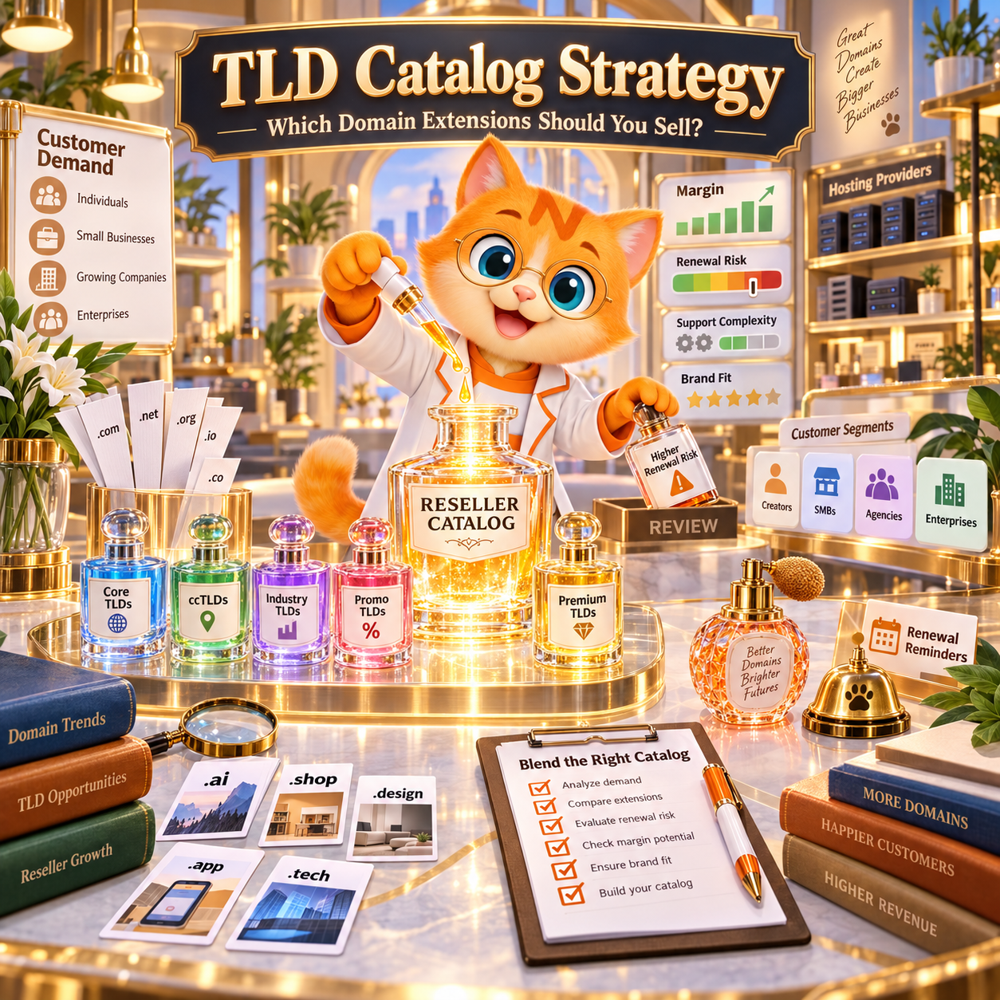

If you run a hosting company, web agency or domain reseller business, do not put every available domain extension in front of every customer simply because your upstream registrar supports it.
A stronger TLD catalog usually has several layers:

core global extensions that serve broad demand;
country-code domains for the markets you actually serve;
industry and use-case extensions relevant to your customers;
promotional or lower-entry extensions for projects where they genuinely fit;
a larger searchable long-tail catalog for customers who need a specific TLD.
The important distinction is:

Upstream TLD coverage and storefront TLD selection are not the same thing.

Broad upstream coverage gives your business flexibility. A focused storefront makes buying easier.

NiceNIC currently supports 2,500+ domain extensions and provides transparent registration and renewal pricing, a Domain Reseller Program, Domain API and WHMCS integration for businesses that want to build a scalable domain catalog.

The goal is not to sell the most TLDs.

The goal is to have the right TLD available when the right customer asks for it.

Why TLD Catalog Strategy Matters
A hosting company may begin by selling only a few familiar extensions.

Then customer requests become more diverse.

One customer wants:

brand.com

Another wants:

brand.de

An ecommerce business asks for:

brand.shop

A startup prefers:

product.app

A customer expanding into another market asks for that country’s ccTLD.

Eventually, the reseller faces two opposite risks.

Too Few TLDs
If your catalog is too narrow:

customers cannot find the extension they want;
they leave your platform to search elsewhere;
you lose the domain order;
you may also lose hosting, Business Email, SSL and future renewals;
international customers may see your service as too limited.
Too Many TLDs Without Structure
If you expose thousands of extensions without organizing them:

customers face too many choices;
renewal pricing becomes harder to understand;
staff must support extensions they rarely sell;
restricted ccTLD requirements create surprises;
Premium pricing can complicate quoting;
your domain search becomes a catalog instead of a decision tool.
The solution is not:

small catalog

or:

huge catalog.

The better model is:

Focused customer experience + broad upstream capability.

What Does the Global TLD Market Tell Resellers?
The domain market is both concentrated and diverse.

According to the Domain Name Industry Brief Q2 2026, the second quarter of 2026 ended with approximately 401.6 million domain registrations worldwide.

The report counted:

166.6 million .COM registrations;
12.5 million .NET registrations;
148.6 million ccTLD registrations;
52.9 million new gTLD registrations.
The same report found that the ten largest gTLDs represented 88.1% of all gTLD registrations as of June 30, 2026.

That gives domain resellers an important lesson:

A relatively small group of extensions can generate a large share of mainstream demand, while country-specific and specialized TLDs still represent a very large market.

Do not interpret registration volume as a list of domains every reseller must sell.

Instead, use market data to establish a broad baseline, then use your own customer data to decide what deserves prominent placement.

Upstream Coverage and Storefront Catalog Are Different Things
This distinction is especially important for hosting providers.

Suppose your registrar supports 2,500+ extensions.

That does not mean your homepage needs 2,500 buttons.

Broad registrar coverage gives you supply flexibility.

Your storefront should provide demand clarity.

A practical model looks like this:

Registrar Layer: Broad TLD Coverage

↓

Reseller Layer: Selected Commercial Catalog

↓

Customer Layer: Relevant Choices

A customer running a small local business may only need five or ten realistic choices.

Your company, however, may still need access to hundreds or thousands of additional extensions when another customer has a specialized requirement.

This is where broad upstream coverage becomes valuable.

You do not need to promote every TLD.

You need to avoid telling a valuable customer:

Sorry, we don't support that extension.

Layer 1: Start With Core Global Extensions
The first layer of a reseller catalog should cover broad, recurring customer demand.

For many international businesses, that normally means starting with established global extensions such as:

.COM
.NET
Then add other extensions that repeatedly appear in your actual customer base.

Do not select the core catalog solely because an extension has a low promotional registration price.

Evaluate:

customer recognition;
registration demand;
renewal demand;
availability;
registration price;
renewal price;
transfer cost;
Premium pricing behavior;
operational simplicity.
A domain sold today can remain with the customer for many years.

That means:

renewal economics matter as much as first-year acquisition pricing.

Before selecting an extension for your catalog, check current lifecycle pricing through NiceNIC Domain Prices.

Layer 2: Add ccTLDs Based on the Markets You Actually Serve
Country-code domains should not be selected randomly.

They should follow customer geography.

If most of your customers operate in one or several countries, identify the ccTLDs most relevant to those markets.

For example, an internationally focused hosting company may receive demand for extensions such as:

.DE
.FR
.AU
.IN
.CN
.TW
But the correct list depends on your customer base.

Do not add a ccTLD merely because it has a large registration base.

Ask:

Do our customers actually operate in this market?

ccTLD Coverage Requires More Than Showing a Price
Country domains can introduce requirements that do not exist for a typical unrestricted gTLD.

Depending on the extension, you may need to handle:

registrant eligibility;
company documentation;
identity verification;
local-presence rules;
trademark requirements;
specific contact information;
special nameserver requirements;
different transfer procedures;
different renewal and expiration rules.
This means a reseller should classify ccTLDs by operational complexity, not only commercial attractiveness.

Before adding a country domain to your visible catalog, answer:

Who can register it?
What information is required?
Can the normal automated workflow handle it?
Does it require manual support?
What is the renewal process?
What happens if the registration is rejected?
For a deeper explanation, see Can a Foreign Company Register ccTLDs?.

NiceNIC also maintains ccTLD Registration Requirements for extensions requiring additional operational information.

Layer 3: Add TLDs for Specific Customer Use Cases
The next layer should follow customer intent.

Do not add extensions simply because they exist.

Add them because a recognizable group of customers can use them.

Ecommerce
Depending on brand strategy and availability, customers may consider extensions such as:

.SHOP
.STORE
.ONLINE
These can be useful alternatives when the preferred .COM is unavailable or when the extension fits the commercial concept.

They do not automatically provide an SEO advantage simply because the keyword appears in the TLD.

The domain still needs to work as a brand.

Technology and SaaS
Technology customers may consider options such as:

.APP
.DEV
.CLOUD
.DIGITAL
.NETWORK
Again, the correct extension depends on:

product positioning;
audience;
memorability;
availability;
recurring cost.
Do not tell customers that a technology-related TLD will automatically improve Google rankings.

Use it when it improves the name.

Content, Communities and Specialized Projects
Other customers may want an extension that communicates what the site does.

The important question is:

Does the complete domain name make sense to the user?

Not:

Does the extension contain a useful keyword?

A reseller catalog should help customers choose a domain.

It should not encourage them to buy an extension they do not understand.

Layer 4: Use Promotional TLDs Carefully
Lower first-year pricing can be useful.

It can help customers launch:

campaign sites;
test projects;
landing pages;
experimental brands;
temporary projects;
low-budget MVPs.
But promotional pricing should never be the only reason you recommend an extension.

Before displaying:

$1.99 first year

also understand:

What does it cost to renew?

A responsible reseller should know:

current registration price;
current renewal price;
transfer price;
restore cost;
Premium-domain behavior.
NiceNIC displays registration and renewal pricing separately through Domain Prices so resellers can review recurring cost before setting their own customer prices.

Layer 5: Keep the Long Tail Searchable
This is where a broad registrar catalog becomes particularly valuable.

There may be many extensions that:

generate too little volume for homepage promotion;
are highly useful to a small group of customers;
are important in one country;
are relevant to one industry;
appear only occasionally in customer requests.
You do not need to feature all of them.

Make them searchable.

A strong customer experience can therefore use:

Featured Catalog
A small set of high-demand extensions.

Category Catalog
Groups such as:

Business
Ecommerce
Technology
Country Domains
Low Entry Cost
Professional
Community
Full Search
The broader upstream catalog.

This gives customers simplicity without sacrificing coverage.

How Many TLDs Should a Reseller Offer?
There is no universal correct number.

A hosting company serving one country may need a relatively focused catalog.

A global reseller may need hundreds of sellable extensions.

A domain-focused platform may need substantially more.

So do not ask:

What is the ideal number of TLDs?

Ask:

What percentage of real customer demand can our current catalog satisfy?

That is a much more useful metric.

Use Search Data to Decide What to Add Next
Your customers will tell you what your catalog is missing.

Track searches where:

the extension is unsupported;
the domain search returns no product;
support receives a request for a missing TLD;
sales staff manually quote a domain not available in the storefront;
customers abandon a domain search and leave the site.
Call this:

Unmet TLD Demand

Every missing search is useful product data.

For example:

If customers repeatedly search for:

.example-country

but your storefront does not offer it, investigate whether:

your upstream registrar supports it;
the registry allows your customers to register it;
pricing is commercially viable;
your system can process it.
Then decide whether to add it.

This is much stronger than guessing which TLD will become popular next.

Measure TLDs by More Than Registration Volume
A registrar may sell thousands of registrations of a low-cost extension and still find it operationally less attractive than another TLD.

A reseller should monitor several dimensions.

Customer Demand
How often do customers search for or buy the extension?

Renewal Behavior
Do customers keep the domain?

Revenue
What gross contribution does the TLD generate after upstream cost?

Support Cost
How many tickets does the extension create?

Registration Success Rate
How often do orders complete successfully?

Operational Complexity
Does the TLD require documents, special contact data or manual processing?

Strategic Value
Does the TLD attract the customer segment your business wants?

This gives a better picture than:

Registrations this month.

A Simple TLD Catalog Decision Model
For every extension, evaluate five questions.

1. Is there real demand?
Use customer searches, orders and sales requests.

2. Can we make the pricing work?
Check registration, renewal, transfer and other lifecycle costs.

3. Can customers understand the product?
If the TLD needs a lengthy explanation every time, decide whether it belongs in the featured catalog or only in search.

4. Can our operation support it?
Consider:

automated registration;
manual registration;
documentation;
renewal;
transfer;
support escalation.
5. Does it fit our customer market?
An extension can be globally popular and still be irrelevant to your audience.

Only when these questions align should the TLD receive prominent placement.

Featured TLD Does Not Mean Best TLD
This distinction matters.

A reseller may mark a domain as:

Popular

Recommended

Business

Ecommerce

or:

Technology

Those labels should describe why the extension is being surfaced.

Do not imply that one TLD is objectively:

best for SEO

without evidence.

Google has repeatedly treated the TLD as only one part of a domain name and does not provide a generic search-ranking bonus simply because a new gTLD contains a keyword.

For customers, the more useful criteria are:

brand fit;
memorability;
market relevance;
trust;
availability;
price;
renewal cost.
Your storefront should help customers make that decision.

Registration Price Alone Is a Bad Catalog Strategy
Suppose two extensions have these pricing patterns:

Extension A
Very low first-year price.

Much higher recurring renewal.

Extension B
Higher first-year price.

More predictable recurring cost.

Neither model is automatically wrong.

They simply serve different customers.

The reseller’s responsibility is to understand the difference before deciding how to position each extension.

For a one-year marketing campaign, a promotional TLD may be suitable.

For a company’s main corporate domain, the customer may care much more about long-term renewal economics.

So before promoting any TLD, review:

registration + renewal + transfer + restore + Premium pricing

not registration alone.

Premium Domains Need Their Own Handling
An extension may normally have one price, while a specific domain under that extension is classified as Premium.

For example:

example.tld

and:

premiumword.tld

may not have the same registration cost.

Depending on the registry, Premium pricing can also affect:

renewal;
transfer;
restore.
A reseller system should therefore avoid hard-coding one price for every domain under a TLD.

Check the actual price returned for the specific domain before presenting the final customer price.

NiceNIC's Domain API provides account-specific domain pricing and supports registrar-side domain workflows for businesses building custom storefronts.

Your Retail Price and Your Upstream Cost Are Different
A reseller needs two pricing layers.

Upstream Cost
What your registrar charges your account.

Retail Price
What you charge your customer.

The difference must support:

payment costs;
customer support;
failed orders;
refunds where applicable;
software;
staff;
taxes;
commercial margin.
This is especially important when the catalog contains many TLDs.

Do not maintain retail pricing based on memory.

Build a process for reviewing upstream prices.

What Happens When a Registry Changes Pricing?
Registry pricing can change.

Promotions can begin.

Promotions can end.

Wholesale costs can increase.

Your reseller storefront therefore needs a pricing-update process.

For a small business, this may mean periodically reviewing the live registrar price list.

For a larger platform, pricing can be integrated into the application’s domain workflow.

NiceNIC provides current pricing through Domain Prices and supports pricing queries through the Domain API.

Do not promise a permanent retail price unless your own business is prepared to absorb future upstream changes.

Do Not Enable a Restricted TLD Without an Exception Workflow
Automation works best when an order has predictable inputs.

Restricted domains can require something different.

For example:

Customer selects TLD

↓

System checks eligibility

↓

Additional information required

↓

Customer submits documentation

↓

Registrar or registry verification

↓

Registration completes

Your system should be able to distinguish that workflow from:

Search → Pay → Registered

If it cannot, keep the TLD outside the fully automated catalog until the exception path is ready.

A Better TLD Catalog for WHMCS Hosting Providers
If you run WHMCS, do not immediately enable every TLD supported by the registrar module.

Start with the extensions your business intends to actively sell.

For each one:

confirm upstream registration price;
confirm renewal price;
set your customer price;
understand transfer pricing;
understand additional requirements;
test a normal registration workflow;
test renewal synchronization;
document what support should do when an order fails.
NiceNIC provides a WHMCS Registrar Integration for hosting providers that want domain registration and lifecycle operations inside their existing billing environment.

Your upstream provider may support thousands of extensions.

Your WHMCS storefront does not need to activate all of them on day one.

A Better TLD Catalog for API-Based Platforms
If you operate:

a SaaS platform;
website builder;
custom hosting panel;
registrar storefront;
internal domain platform;
the catalog can be more dynamic.

Your system can use the registrar API to:

check availability;
retrieve current pricing;
identify whether the product can be ordered;
collect required information;
submit supported operations;
surface the correct result to the customer.
NiceNIC currently makes Domain API access available to active Market and Reseller Accounts.

That means a development team can test the integration first and evaluate reseller pricing separately.

Use the NiceNIC API Sandbox to test application logic before using production orders.

Broad TLD Coverage Reduces Upstream Fragmentation
This is one of the most important issues for international resellers.

Imagine your first registrar supports your major gTLDs.

Then you add another provider for one group of ccTLDs.

A third provider handles another region.

A fourth has a TLD your enterprise customer needs.

You now have:

four balances;
four API integrations;
four account-security systems;
four pricing feeds;
four renewal processes;
four support teams;
multiple commercial agreements.
That can work.

But it creates operational cost.

A registrar with broad TLD coverage can reduce the number of upstream relationships a reseller needs to maintain.

NiceNIC currently supports 2,500+ domain extensions.

The important reseller benefit is not that every customer should buy from a list of 2,500 extensions.

It is:

When customer demand expands, you have a larger supply catalog available without immediately adding another upstream registrar.

What Hosting Providers Should Look for in an Upstream Registrar
TLD count is only one factor.

Before choosing a registrar partner, check:

TLD Coverage
Can it support the markets your customers serve?

Registration and Renewal Pricing
Can you see recurring costs before selling the domain?

ccTLD Support
Can the registrar explain eligibility and documentation requirements?

API
Can you automate the operations your platform needs?

WHMCS
Can your existing hosting workflow connect without unnecessary development?

Bulk Tools
Can operations staff manage multiple domains efficiently?

Account Funding
Can you keep enough usable balance available for recurring operations?

Human Support
When the registry rejects an order, can someone help determine why?

Automation handles ordinary operations.

Registrar support matters when an operation is not ordinary.

How NiceNIC Fits a Multi-TLD Reseller Strategy
NiceNIC is an ICANN-accredited registrar, IANA Registrar ID 3765.

For hosting providers, web agencies, SaaS platforms and domain resellers, its current platform combines:

2,500+ domain extensions;
Market and reseller account options;
registration and renewal pricing visibility;
bulk domain tools;
Domain API;
API Sandbox;
WHMCS integration;
ccTLD operational guidance;
human support.
The NiceNIC Reseller Program provides account-level pricing for businesses with recurring domain volume.

The important distinction is:

API access and reseller pricing are separate decisions.

You can evaluate the technical workflow before deciding whether a reseller pricing level fits your commercial volume.

A Low-Risk Way to Test a New Upstream Registrar
Do not move your entire domain business based on a feature list.

Run a controlled test.

Step 1: Export Your Current TLD Sales
Identify:

most registered TLDs;
most renewed TLDs;
most searched unsupported TLDs.
Step 2: Choose a Real Test Catalog
Select extensions representing:

mainstream demand;
one or more ccTLDs;
a new gTLD;
a Premium-pricing scenario if relevant.
Step 3: Compare Lifecycle Pricing
Check:

register;
renew;
transfer;
restore where applicable.
Step 4: Test the Technical Workflow
Use:

Control Panel;
WHMCS;
Domain API;
Sandbox where appropriate.
Step 5: Test an Exception
Do not test only successful registrations.

Also test how your team handles:

unavailable domain;
unsupported request;
incorrect parameter;
restricted TLD;
insufficient balance;
transfer problem.
Step 6: Measure Support Quality
Ask:

If the automated workflow cannot finish the order, can our team get a useful answer?

Step 7: Expand Gradually
Once the workflow works:

Core Catalog → Regional Catalog → Specialized Catalog → Long Tail

This reduces migration risk.

Common TLD Catalog Mistakes
"Our registrar supports 2,500 TLDs, so we should display all 2,500."
No.

Coverage and merchandising are different functions.

"The cheapest first-year domains should appear first."
Not necessarily.

Renewal cost, customer purpose and brand fit matter.

"The most registered TLDs are automatically the best TLDs for our customers."
No.

Global market size and your own customer demand are different metrics.

"We only need .COM and .NET."
That may work for some customer bases.

International customers can create demand for country domains and specialized extensions.

"Every ccTLD can use the same registration form."
No.

Registry requirements vary.

"If a TLD is available through the API, the registration must be fully automatic."
Not always.

Eligibility, verification or documentation can still be required.
